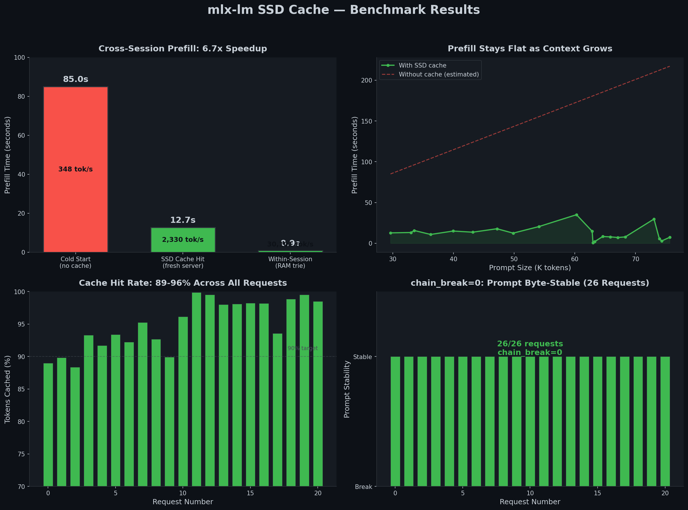

# mlx-lm — Qwen 3.6 on Apple Silicon, Done Right

Fork of [mlx-explore/mlx-lm](https://github.com/ml-explore/mlx-lm) focused on making
Qwen 3.6 models (35B MoE, 27B) work reliably on M-series Macs for long-running
agent workloads like [Hermes Agent](https://hermes-agent.nousresearch.com/).

Everything operates on the key-value cache — no model weight changes, no new
architectures. The problem: a 35B MoE model on 64GB M1 Max uses ~25-30GB for
weights, leaving ~34GB for KV cache. A single 45K-token conversation fills
6-8GB. Long agent sessions run out of RAM, hit swap, and everything slows down.

This fork solves that from four angles.

---

## Quick Start

```bash
pip install -e .

mlx_lm.server \
  --model ~/.cache/huggingface/hub/Qwen3.6-35B-A3B-UD-MLX-4bit \
  --host 127.0.0.1 --port 8000 \
  --chat-template-args '{"enable_thinking": false}' \
  --kv-bits "(8, 4)" --kv-group-size "(64, 32)" \
  --block-ssd-cache-dir ~/.cache/mlx-lm/block_ssd_cache \
  --block-ssd-cache-max-size 50 \
  --prompt-cache-size 10
```

---

## 1. KV Cache Quantization — Fit More Context in Less RAM

### The problem

At FP16, each KV cache layer costs ~384MB at 128K context. With 10 KV layers
on Qwen3.6-35B, that's ~3.8GB just for the cache. Add model weights and you're
at 28-30GB — leaving little headroom before swap kicks in.

### What this fork does

Asymmetric quantization: keys at higher precision (K8), values lower (V4).
Keys participate in the attention dot product — noise there directly shifts
which tokens the model attends to. Values are softmax-weighted sums — a
low-pass filter that tolerates more compression.

```
                    FP16    K8+V4    K8+V4 + boundary
KV cache (128K)    3.8 GB   2.7 GB   2.76 GB
Model weights      20 GB    20 GB    20 GB
Peak RAM           ~30 GB   ~28 GB   ~28 GB
Headroom (64GB)    ~34 GB   ~36 GB   ~36 GB
```

```bash
--kv-bits "(8, 4)" --kv-group-size "(64, 32)"
```

Boundary layers (first 2 + last 2 KV layers) stay at K8+V8 because they handle
input embedding projection and final logit transformation where quantization
noise compounds. Middle layers operate on already-abstracted representations
where V4 is fine.

```bash
--kv-boundary-layers 2 --kv-boundary-bits "(8,8)"   # default
--kv-boundary-layers 0                                # disable
```

Reference: [KIVI (NeurIPS 2024)](https://arxiv.org/abs/2402.02750).

### Why not TurboQuant?

TurboQuant compresses KV cache to ~3 bits using Walsh-Hadamard transforms.
For Qwen 3.6 hybrid architectures (full_attention_interval=4), only 10 of 40
layers have KV caches. At 128K context the total KV cache is 1-3GB. Moving
from K8+V4 to TurboQuant 3-bit saves ~80MB (35B-A3B) or ~256MB (27B) — not
enough to justify the WHT compute overhead and implementation complexity.
K8+V4 with boundary protection is the sweet spot for these models.

---

## 2. SSD Prompt Cache — Keep Conversations Alive Across Restarts

### The problem

The RAM prompt cache (`LRUPromptCache`) holds KV entries in memory. Restart
the server, and the entire cache is gone. Every conversation starts from
scratch — full 85-second prefill for a 29K-token system prompt.

### What this fork does

Two-tier cache with disk persistence:

```
fetch_nearest_cache(model, tokens)
  +-- RAM tier (PromptTrie + hot cache)     → hit: deepcopy, 30,000 tok/s
  +-- SSD tier (BlockSSDCache, 256-token blocks) → hit: deserialize + promote
```

Each 256-token block is a safetensors file on disk, chained via hash:
`SHA256(parent_hash || model_key || block_tokens)`. On startup, the 64
most-recent blocks are pre-loaded into an in-memory LRU hot cache (~52ms).

```bash
--block-ssd-cache-dir ~/.cache/mlx-lm/block_ssd_cache
--block-ssd-cache-max-size 50   # GB
```

### What it costs

The initial implementation had 4 performance bugs that caused prefill to
regress from ~650 tok/s to 4.5 tok/s. All fixed:

| Bug | Root Cause | Fix |
|-----|-----------|-----|
| No hot cache | Every SSD hit read from disk | LRU `_hot_cache` in RAM |
| Per-block mx.eval | 120 GPU sync points during prefill | Batch eval after all blocks loaded |
| Deep copy overhead | `copy.deepcopy()` per block per layer | Direct `mx.load()` without intermediary |
| Eviction thrashing | `_maybe_evict()` called per block save | Deferred to post-request flush |

---

## 3. Prefill Reliability — Making Caching Actually Work with Quantized KV

Caching with asymmetric KV quantization is tricky. Several upstream issues
caused silent cache corruption or missed reuse:

- **Prompt-tag bug** — `max_tokens` truncation injected wrong tags into cached
  prefixes, poisoning subsequent requests (5-part fix across `_serve_single`,
  `_tokenize`, and segment handling)
- **ArraysCache trim** — multimodal models use `ArraysCache` for non-KV layers,
  but `trim()` wasn't implemented, causing crashes on prefix trim
- **pop_prefixes checkpoints** — intermediate system/user checkpoints were lost
  during prefix operations, breaking the trie invariant
- **max_tokens default** — missing `max_tokens` in the API request caused
  silent response truncation

These fixes ensure that cache hits return correct results, not just fast ones.

---

## 4. Observability — See What the Cache Is Doing

Every request logs a single `PERF` line with full cache health:

```
PERF: prompt_tps=2330.4 prompt_tok=29624 pref_tok=3256 prefill=12.71s
      block_hit=103 block_write=0 chain_break=0
```

| Field | Meaning |
|-------|---------|
| `pref_tok` | Tokens actually recomputed (not served from cache) |
| `block_hit` | Blocks loaded from SSD this request |
| `block_write` | New blocks written to SSD |
| `chain_break` | 1 = block-0 prefix mismatch (prompt drifted) |

```bash
# Find cache regressions
grep "PERF:" server.log | grep "chain_break=1"

# Find requests with no cache reuse
grep "PERF:" server.log | grep "pref_tok=[0-9]\{4,\}"
```

---

## Benchmarks

**Hardware:** M1 Max 64GB | **Model:** Qwen3.6-35B-A3B-UD-MLX-4bit

### Cross-session SSD cache (Hermes Agent, 29K-token system prompt)

| | prefill | tok/s | cached |
|---|---|---|---|
| Cold (no SSD) | 85.01s | 348 | 0% |
| SSD hit (Run 2) | 12.71s | 2,330 | 89% |
| Within-session | 0.90s | 30,101 | 99.9% |

**6.7x** cross-session prefill speedup. **538x** within-session.

### Long conversation (21 requests, 29K → 75K tokens)

| prompt_tok | pref_tok | cached | chain_break | prefill |
|---|---|---|---|---|
| 29,629 | 3,261 | 89% | 0 | 12.78s |
| 33,019 | 3,360 | 90% | 0 | 13.22s |
| 39,943 | 3,318 | 92% | 0 | 15.01s |
| 47,165 | 3,672 | 92% | 0 | 17.83s |
| 63,297 | 302 | 99.5% | 0 | 2.20s |
| 75,641 | 1,143 | 98.5% | 0 | 7.37s |

Prefill stays flat (~13-18s) despite prompt growing to 47K tokens.
`chain_break=0` on every request — prompt byte-stable.



Full data: [docs/SSD_CACHE_BENCHMARK_FIX_ABC.md](docs/SSD_CACHE_BENCHMARK_FIX_ABC.md)

---

## CLI Flags (Fork-Specific)

| Flag | Default | Description |
|------|---------|-------------|
| `--kv-bits` | `8` | KV bit-width: int or tuple `(key, value)` |
| `--kv-group-size` | `64` | Quantization group size: int or tuple |
| `--kv-boundary-layers` | `2` | Boundary KV layers to protect (0=off) |
| `--kv-boundary-bits` | `(8,8)` | Bit-width for boundary layers |
| `--block-ssd-cache-dir` | — | Directory for SSD block cache |
| `--block-ssd-cache-max-size` | `50` | Max SSD cache size (GB) |
| `--prompt-cache-size` | `10` | RAM cache entries |

---

## What's Next: DFlash

[DFlash](https://huggingface.co/collections/z-lab) models are distilled/optimized
variants of Qwen 3.5 and 3.6, available in 27B and 35B-A3B sizes. The SSD caching
infrastructure in this fork makes iterative testing on DFlash variants practical —
long benchmark sessions survive server restarts without losing prefix cache.

Models in cache:
- `Qwen3.5-27B-DFlash`
- `Qwen3.5-35B-A3B-DFlash`
- `Qwen3.6-35B-A3B-DFlash`

---

## Attribution

- [ml-explore/mlx-lm](https://github.com/ml-explore/mlx-lm) — upstream
- [KIVI (Liu et al., NeurIPS 2024)](https://arxiv.org/abs/2402.02750) — asymmetric quantization
- [TurboQuant+](https://github.com/TheTom/turboquant_plus) — boundary-aware compression
- [jundot/omlx](https://github.com/jundot/omlx) — `paged_ssd_cache.py` reference
- [Goose #4610](https://github.com/block/goose/issues/4610) — timestamps preventing LLM caching
- [EPIC (2410.15332)](https://arxiv.org/abs/2410.15332) — position-independent caching
- [Prompt Cache (2311.04934)](https://arxiv.org/abs/2311.04934) — modular attention reuse
- [CacheBlend (2405.16444)](https://arxiv.org/abs/2405.16444) — selective KV recomputation
